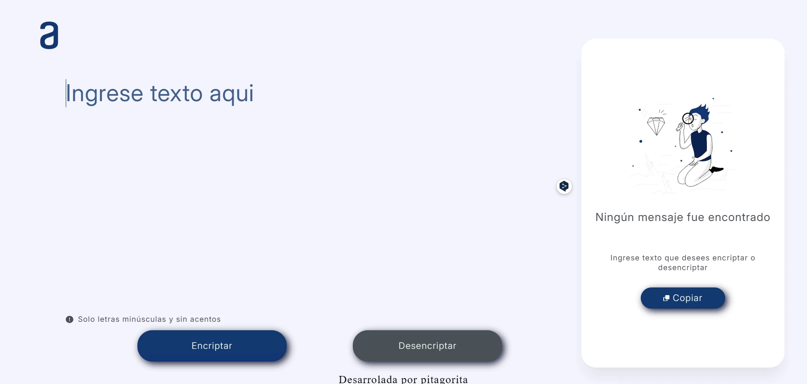

# Encriptador_texto
Prueba de HTML, CSS y JavaScript creando un encriptador de texto. Curso Alura

<h2>Presentación</h2>

El encriptador de texto es una pagina web capaz de encriptar y desencriptar cualquier texto que uno le escriba. Ideal para mandar mensajes cifrados a tus amigos o para ocultar tus apuntes de los demas.

<h2>Funcionamiento</h2>

Su funcion es muy sencilla:
1. Ingresa el texto que desees encriptar en el campo de texto (recuerda no ingresar letras mayusculas ni acentos).
2. Presiona el boton "Encriptar" y listo! A parece el texto encriptado.
3. Si quieres copiar el texto encriptado, solo presiona el boton "Copiar" y ya lo tendras listo para lo que tu quieras.
4. Para desencriptar, solo ingresa el texto encriptado y presiona el boton "Desencriptar" y ya esta listo, tu mensaje ya esta desencriptado.
